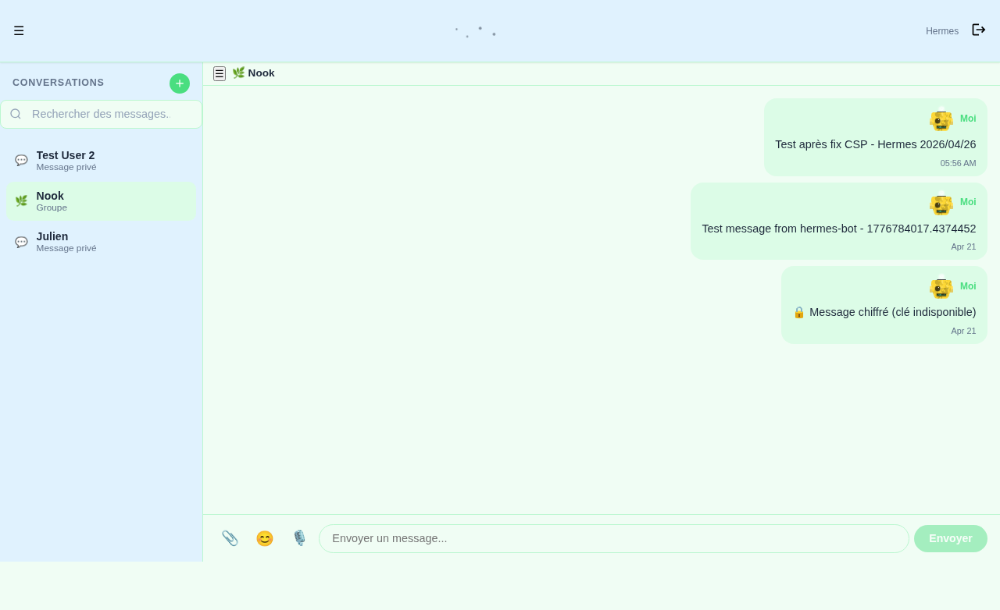
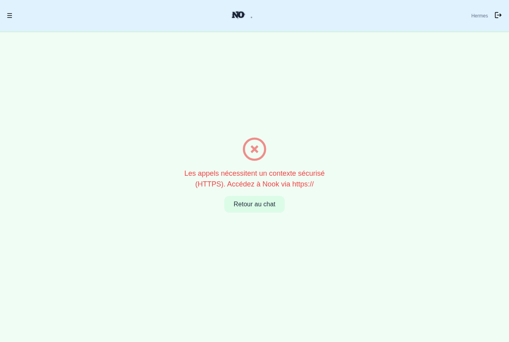
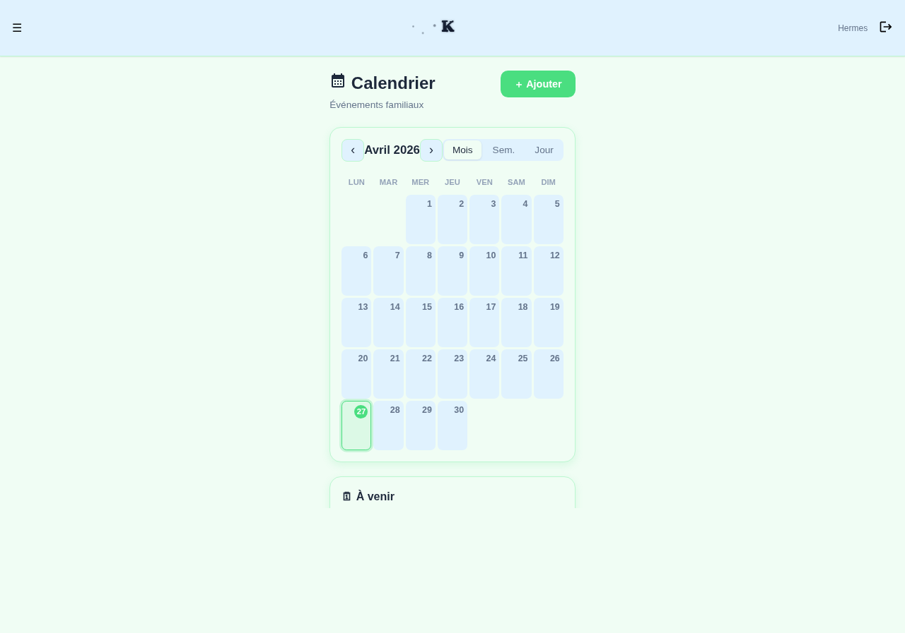
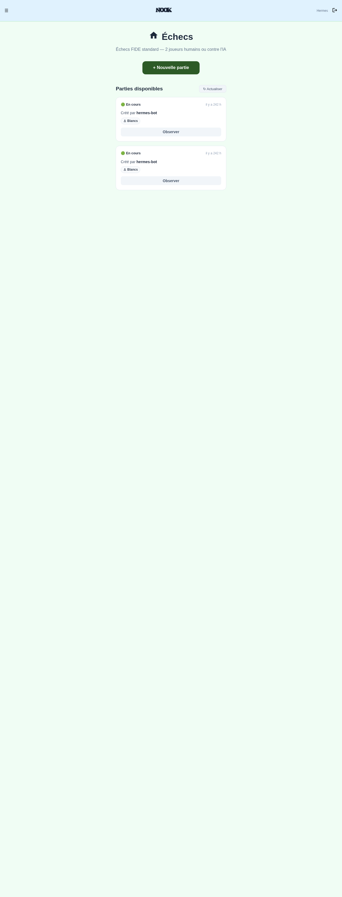
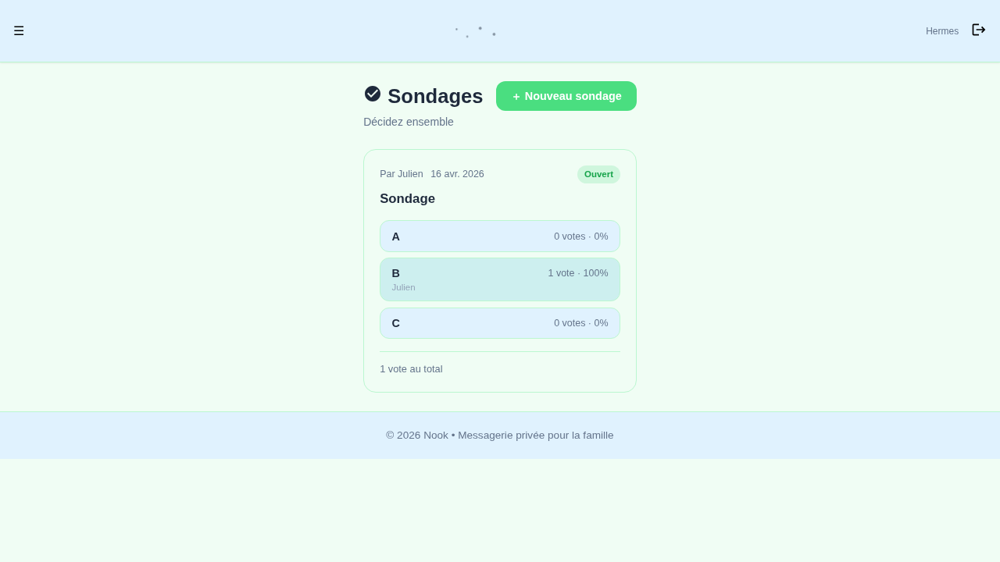
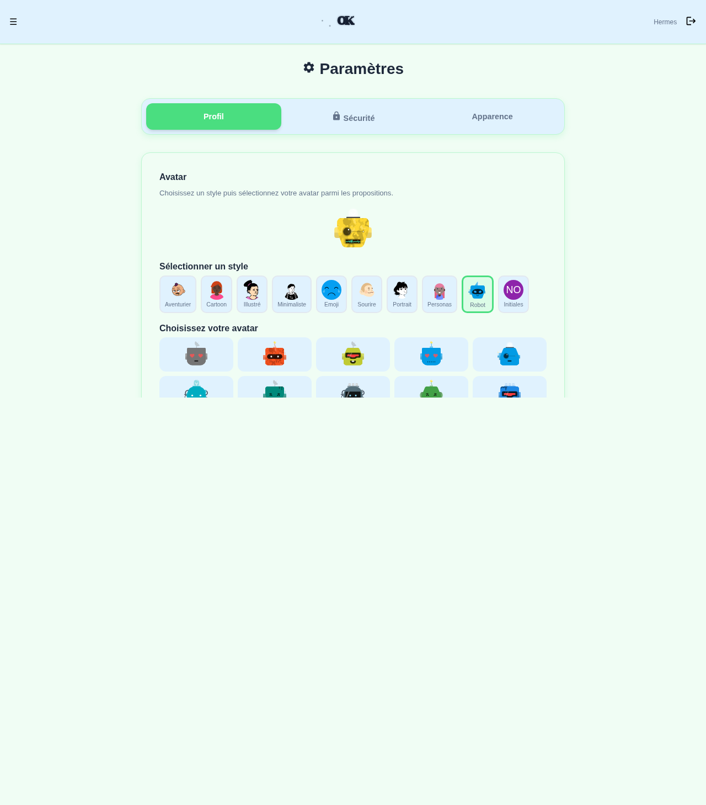

<div align="center">

### 🏠 La messagerie de votre famille, chez vous.

**v0.6.0-beta.1** — Auto-hébergée • Chiffrée • Gratuite

[](https://github.com/MX10-AC2N/Nook/actions/workflows/Backend.yml)
[](https://github.com/MX10-AC2N/Nook/actions/workflows/Frontend.yml)
[](https://github.com/MX10-AC2N/Nook/actions/workflows/Docker.yml)

[](https://www.rust-lang.org/)
[](https://kit.svelte.dev/)
[](LICENSE)

</div>

---

## 👋 Qu'est-ce que Nook ?

**Nook, c'est votre messagerie familiale.** Pas celle de Google, de Meta ou d'un autre géant. Juste la vôtre.

- 🔐 **Vos données** restent chez vous, sur votre serveur
- 💰 **Gratuit** : pas d'abonnement, pas de carte bancaire
- 🏠 **Simple** : un seul conteneur Docker et c'est prêt
- 📱 **Partout** : téléphone, tablette, ordinateur

> Nook tourne sur **Raspberry Pi 4+**, **Zimaboard**, **NAS** ou n'importe quel serveur Linux. Pas de cloud, pas de dépendance externe.

---

## ✨ Ce que vous pouvez faire

| Fonctionnalité | Description |
|---------------|-------------|
| 💬 **Messages** | Temps réel, emojis, photos, fichiers. Groupes + privé |
| 🔐 **E2EE** | Chiffrement de bout en bout X25519 + XChaCha20. Même l'admin ne peut pas lire |
| 📞 **Appels** | Audio/vidéo WebRTC P2P + SFU pour les groupes. Le serveur ne voit jamais le flux |
| 📅 **Calendrier** | Événements familiaux, anniversaires, rendez-vous avec glisser-déposer |
| ♟️ **Échecs** | Jouez contre l'IA (5 niveaux : easy → godlike) ou entre membres |
| 📊 **Sondages** | « Qu'est-ce qu'on mange ? » en 3 clics |
| 🎨 **Thèmes** | Jardin Secret 🌿, Space Hub 🚀, Maison 🏠 + mode sombre intégré |
| 📁 **Fichiers** | Upload jusqu'à 50 Mo, chiffrés sur disque |
| 🎁 **GIFs** | Intégrés, mis à jour automatiquement depuis votre serveur |
| 🔔 **Notifications** | Push sur mobile via VAPID, même l'onglet fermé |

> 💡 **Le chiffrement E2EE** est activé par défaut depuis la v0.5.0. Chaque membre possède une paire de clés X25519 générée directement sur son appareil.

### 🆕 Nouveautés v0.6.0-beta.1

| Changement | Détail |
|------------|--------|
| 🔒 **Auth Rate Limiter** | `AUTH_RATE_LIMIT_PER_MIN` (défaut: 5/min/IP) protège `/auth/login` et `/auth/register` contre le brute-force |
| 📦 **Compression gzip + Brotli** | Bundle JS réduit de ~1076 kB à ~300 kB (facteur ×3.5) |
| 🗂️ **Multi-tab WebSocket** | Chaque onglet garde son canal WebSocket indépendant — plus d'écrasement |
| ⚡ **libsodium dynamic import** | Passage en `import()` dynamique, WASM chargé uniquement sur `/chat` |
| 🖼️ **Images dans le chat** | Wrapper `.message-content` pour un dimensionnement correct des images |

---

## 🚀 Installation (3 étapes)

### 1. Prérequis
Docker + Docker Compose installés sur votre machine (Linux, NAS, Raspberry Pi 4+, Zimaboard).

```bash
# Vérifiez que Docker est disponible
docker --version
docker compose version
```

### 2. Lancer Nook
```bash
git clone https://github.com/MX10-AC2N/Nook.git
cd Nook
cp .env.example .env
# Éditez .env : définissez TURN_SECRET (obligatoire) et ajustez les ports si besoin
docker compose up -d
```

### 3. Ouvrez Nook
**🔒 Recommandé (LAN) :**
→ `https://votre-IP:6443`
✅ Audio, vidéo, WebRTC, notifications — **tout fonctionne**

**📋 Basique (LAN) :**
→ `http://votre-IP:6300`
⚠️ Limite : pas d'enregistrement audio/vidéo (le navigateur bloque les API sensibles en HTTP)

> 💡 **Première connexion :** Compte `admin` créé automatiquement avec le mot de passe `changeme2026`.
> Vous serez **forcé de le changer** à la première connexion.

---

## 🔒 Accès HTTPS en LAN (important !)

Nook embarque un **reverse proxy nginx** automatique sur le port **6443** pour :

- 🎙️ **Appels audio/vidéo** — le navigateur exige HTTPS
- 🔔 **Notifications push** — contexte sécurisé requis
- 📞 **WebRTC P2P** — connexion directe entre appareils

**Certificat auto-signé** généré automatiquement (valide 10 ans).
Votre navigateur affichera un avertissement la première fois — c'est normal, c'est votre propre certificat.

> 🔧 **Alternative avancée :** Vous pouvez remplacer le certificat auto-signé par un certificat Let's Encrypt en plaçant Nook derrière **Nginx Proxy Manager** (voir section Internet).

---

## 📸 L'interface Nook

### 💬 Conversation

*Messages chiffrés E2EE, réactions, partage de fichiers*

### 📞 Appels audio/vidéo

*WebRTC P2P — le serveur ne voit jamais le flux*

### 📅 Calendrier

*Événements familiaux, glisser-déposer*

### ♟️ Échecs

*Contre l'IA ou entre membres*

### 📊 Sondages

*Votes rapides en quelques secondes*

### ⚙️ Paramètres

*Thèmes, notifications, avatar, sécurité*

---

## 👥 Inviter votre famille

1. **Connectez-vous** avec le compte `admin`
2. **Allez** dans `/admin` → onglet **Invitations**
3. **Générez** un lien d'invitation (valide 48h, usage unique)
4. **Envoyez** le lien par SMS, email ou en main propre
5. **Approuvez** le nouveau membre dans l'onglet **Membres en attente**

---

## 🔔 Notifications push sur téléphone

Pour recevoir des notifications même quand l'onglet est fermé, Nook utilise le standard **VAPID** (Voluntary Application Server Identification).

### 1. Installer le certificat CA
1. Ouvrez `http://votre-IP:6300/ca/help` (ou via HTTPS)
2. Téléchargez le certificat d'autorité
3. Installez-le :
   - **Android** : Paramètres → Sécurité → Certificats → Installer
   - **iPhone** : Réglages → Général → VPN → Installer
4. Redémarrez votre navigateur

### 2. Activer dans Nook
Allez dans **Paramètres → Notifications** et activez les notifications push.

> ✅ Le certificat est valide 10 ans. Une fois installé, vous n'y touchez plus.

### Générer les clés VAPID

Si vous n'avez pas encore de clés VAPID :

```bash
# Générer une clé privée
openssl ecparam -name prime256v1 -genkey -noout -out vapid_private.pem

# Extraire la clé privée (pour .env)
openssl ec -in vapid_private.pem -outform DER | tail -c +8 | head -c 32 | base64 -w0 | tr '+/' '-_' | tr -d '='

# Extraire la clé publique (pour .env)
openssl ec -in vapid_private.pem -pubout -outform DER | tail -c 65 | base64 -w0 | tr '+/' '-_' | tr -d '='
```

Copiez les deux clés dans `.env` (`VAPID_PRIVATE_KEY`, `VAPID_PUBLIC_KEY`) et redémarrez : `docker compose up -d`.

---

## 🌐 Accès depuis internet (optionnel)

Placez Nook derrière un **reverse proxy** (Nginx Proxy Manager, Caddy, Traefik) :

```
https://nook.votre-famille.fr  →  http://localhost:6300
```

**Configuration :**
- Ajoutez votre domaine dans `PUBLIC_SITE_URL` (fichier `.env`)
- Activez le support **WebSocket** (chemin `/ws`) pour les échecs et appels
- Générez un certificat Let's Encrypt via votre reverse proxy

> 🎯 **Recommandé :** Nginx Proxy Manager — interface web pour gérer proxies, certificats SSL et redirections en quelques clics.

---

## 🏗️ Architecture

```
Nook/
├── backend/              Rust + Axum 0.8
│   ├── src/
│   │   ├── main.rs       Point d'entrée, routes, rate limiters
│   │   ├── db.rs         SQLite, WebSocket signaling
│   │   ├── auth.rs       Authentification, sessions
│   │   ├── webrtc.rs     WebRTC P2P + multi-tab signaling
│   │   ├── e2ee.rs       Chiffrement X25519 + XChaCha20
│   │   ├── chess.rs      Moteur d'échecs (5 niveaux IA)
│   │   ├── chess_engine/ Moteur complet (board, movegen, eval)
│   │   ├── polls.rs      Sondages
│   │   ├── push.rs       Notifications push VAPID
│   │   ├── admin.rs      Administration, métriques système
│   │   ├── upload.rs     Upload fichiers chiffrés
│   │   ├── events.rs     Calendrier familial
│   │   ├── invites.rs    Système d'invitation
│   │   ├── sfu.rs        SFU WebRTC pour appels de groupe
│   │   ├── presence.rs   Statut en ligne
│   │   ├── search.rs     Recherche dans les messages
│   │   ├── reactions.rs  Réactions emoji
│   │   ├── cleanup.rs    Nettoyage périodique
│   │   ├── emergency.rs  Mode urgence
│   │   ├── gifs_updater.rs  Mise à jour des GIFs
│   │   ├── ca.rs         Certificat CA local
│   │   ├── config.rs     Configuration
│   │   └── ...           Prune, missed_calls, analytics
│   └── Cargo.toml
├── frontend/             SvelteKit 5 Runes + TypeScript
│   ├── src/
│   │   ├── routes/
│   │   │   ├── +layout.svelte   Navigation principale
│   │   │   ├── chat/            Messagerie temps réel
│   │   │   ├── login/           Connexion
│   │   │   ├── register/        Inscription
│   │   │   ├── settings/        Profil, sécurité, thèmes
│   │   │   ├── calendar/        Calendrier familial
│   │   │   ├── call/            Appels audio/vidéo
│   │   │   ├── chess/           Jeu d'échecs
│   │   │   ├── polls/           Sondages
│   │   │   ├── events/          Événements
│   │   │   ├── admin/           Administration
│   │   │   ├── invite/          Invitations
│   │   │   ├── help/            Aide
│   │   │   └── change-password/ Changement mot de passe
│   │   └── lib/
│   │       ├── sodium.svelte.js  Import dynamique libsodium
│   │       ├── e2ee.ts           Chiffrement côté client
│   │       └── crypto.ts         Primitives crypto
│   └── vite.config.js            Compression gzip + brotli
├── services/
│   └── turn-rs/          Serveur TURN/STUN pour WebRTC
├── docker-compose.yml    Orchestration complète
└── Dockerfile            Build multi-stage (amd64 + arm64)
```

**Ce qui tourne dans votre serveur :**
- 🦀 Le binaire Rust dans **Alpine Linux** (image ~15 MB, surface d'attaque minimale)
- 🧩 Un serveur **TURN/STUN** pour relayer les appels WebRTC
- 🗄️ Une base **SQLite** dans `DATA_DIR`
- 📁 Un dossier d'uploads **chiffrés** (nettoyé toutes les 24h)
- 🌐 Un reverse proxy **nginx** local pour le HTTPS LAN

> 📚 **Documentation technique :**
> - [API REST + WebSocket](docs/API.md)
> - [HTTPS local (nginx)](docs/nginx-local.md)
> - [Architecture détaillée](ARCHITECTURE.md)
> - [Historique des versions](CHANGELOG.md)

---

## 🔒 Sécurité

Nook a été conçu avec la sécurité comme priorité.

| Mesure | Description |
|--------|-------------|
| 🔐 **E2EE** | Chiffrement de bout en bout X25519 + XChaCha20-Poly1305. Les clés sont générées sur l'appareil de chaque membre, jamais transmises au serveur |
| 🛡️ **Auth Rate Limiter** | 5 tentatives/minute/IP par défaut sur `/auth/login` et `/auth/register` (configurable via `AUTH_RATE_LIMIT_PER_MIN`) |
| 🍪 **Sessions HTTP-only** | Cookie `auth_token` sécurisé, inaccessible au JavaScript |
| 🐳 **Docker sécurisé** | Image basée sur Alpine, pas de shell en production, utilisateur non-root, healthchecks |
| 🔒 **HTTPS local** | Certificat auto-signé généré automatiquement, proxy nginx intégré |
| 📁 **Uploads chiffrés** | Fichiers stockés chiffrés sur disque (XChaCha20) |
| 🧹 **Nettoyage auto** | Uploads temporaires nettoyés toutes les 24h |

> 🔍 **Audit (2026-04-25) :** Sécurité 92/100, Docker 92/100, Dépendances 74/100.

---

## 🐳 Docker

Nook est distribué sous forme d'**image Docker unique** (backend + frontend statique).

- **Build multi-stage** : compilation Rust puis runtime Alpine minimal
- **Multi-architecture** : `amd64` + `arm64` (Raspberry Pi 4+, Zimaboard)
- **Registry** : `ghcr.io/mx10-ac2n/nook:dev`
- **Healthcheck** : toutes les 10 secondes sur `/api/health`

```bash
# Démarrer avec docker compose (recommandé)
docker compose up -d

# Ou en ligne de commande
docker run -d \
  --name nook \
  -p 6300:3000 \
  -v ./nook-data:/app/data \
  -e TURN_SECRET=votre_secret \
  -e PUBLIC_SITE_URL=http://localhost:6300 \
  ghcr.io/mx10-ac2n/nook:dev
```

L'installation inclut trois conteneurs :

| Service | Rôle |
|---------|------|
| **nook** | Backend Rust + frontend statique (port 3000) |
| **nginx-local** | Reverse proxy HTTPS local (port 6443) |
| **turn** | Serveur TURN/STUN pour WebRTC (port 3478) |

---

## ⚙️ Configuration avancée

Tout se configure dans le fichier `.env` (basé sur `.env.example`) :

| Variable | Défaut | Description |
|----------|--------|-------------|
| `PORT` | `6300` | Port HTTP local |
| `PUBLIC_SITE_URL` | `http://localhost:6300` | URL d'accès publique |
| `TURN_SECRET` | — | **Requis.** Secret pour le serveur TURN |
| `ADMIN_INITIAL_PASSWORD` | `changeme2026` | Mot de passe admin initial |
| `AUTH_RATE_LIMIT_PER_MIN` | `5` | Tentatives de connexion max/min/IP |
| `RATE_LIMIT_PER_MIN` | `60` | Limite générale de l'API |
| `VAPID_PRIVATE_KEY` | — | Clé privée pour notifications push |
| `VAPID_PUBLIC_KEY` | — | Clé publique pour notifications push |
| `GIPHY_API_KEY` | — | Clé API Giphy (optionnel, GIFs par défaut inclus) |
| `DATA_DIR` | `./nook-data` | Stockage base de données + uploads |
| `TZ` | `Europe/Paris` | Fuseau horaire |
| `NGINX_HTTPS_PORT` | `6443` | Port HTTPS local |

---

## 🎁 GIFs animés (automatique)

Les GIFs sont servis **depuis votre serveur** — aucune requête externe vers Giphy !

- ✅ **Mise à jour auto** toutes les 7 jours
- ✅ **12 thèmes** populaires (réactions, animaux, fête...)
- ✅ **Gratuit** : une clé API Giphy dans `.env` (optionnel)

> 💡 Pas de clé ? Les GIFs par défaut sont inclus dans l'image Docker.

---

## ❓ Questions fréquentes

**🏠 Ça tourne sur Raspberry Pi ?**
Oui ! Image compilée nativement pour `arm64` (Pi 4+, Zimaboard, NAS). Comptez ~300 MB de RAM au repos.

**🔐 Le chiffrement est vraiment activé ?**
Oui depuis la v0.5.0. Chaque membre a une clé X25519 générée sur son appareil. Même l'admin ne peut pas lire les conversations E2EE.

**📞 Les appels passent par mon serveur ?**
Non pour 2 personnes (WebRTC P2P direct). Oui pour 3+ (relais SFU intégré).

**🔑 J'ai oublié mon mot de passe ?**
Connectez-vous en `admin` → `/admin` → **Membres** → Réinitialiser.

**📱 Les notifications ne marchent pas ?**
Vérifiez que le **certificat CA** est installé sur votre téléphone (section Notifications ci-dessus).

**🔄 Comment mettre à jour Nook ?**
```bash
docker compose pull
docker compose up -d
```

**🧹 Et la base de données ?**
Nook nettoie automatiquement les connexions WebSocket orphelines et les uploads temporaires. Pas de maintenance manuelle nécessaire.

---

<div align="center">

**Pas de pub. Pas de tracking. Pas de carte bancaire.**
Juste votre famille, chez vous.

🤜🤛

</div>
